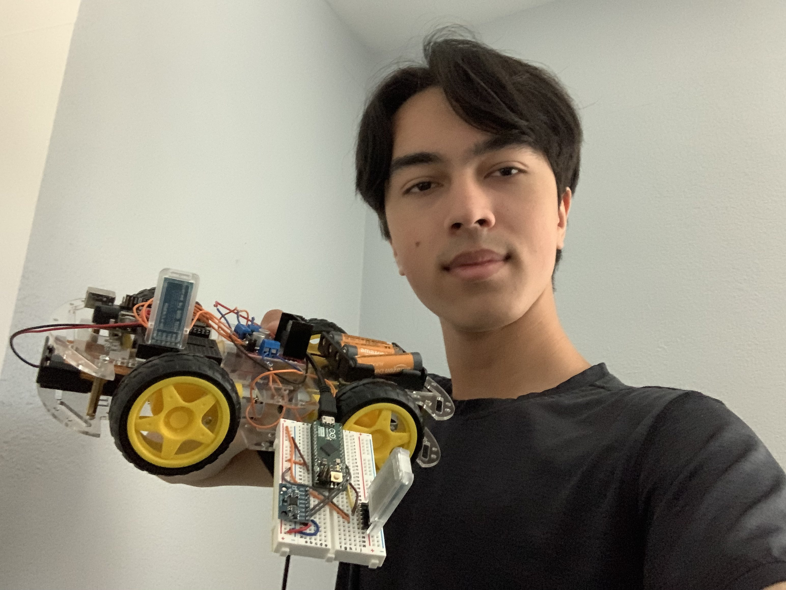

# Guesture Controlled Robot
My project is a guesture controlled robot. This project has two seperate parts, the robot, and the controller. The robot part of this project has 4 wheels and can drive around. The controller uses a bluetooth conection to the robot to tell it what to do, which is decided by the controller based on an accelerometr that is used to detect the motion of the controller. This means that by moving the controller in a certain way, you will be able to move the robot.

| **Engineer** | **School** | **Area of Interest** | **Grade** |
|:--:|:--:|:--:|:--:|
| Nolan S. | Alameda High | Computer Science | Incoming Senior

<div align="center">
  
</div>
  
# Final Milestone
My final milestone was completing the entire project. 
- Since the last milestone, I have written all of the code and connected the accelerometer to the controller. 
- The hardest part about this project was due to the project having both hardware and software. This meant that if there was an error, I had to check both the hardware and the software. Because of this I was constantly double checking my wiring and my code in order for the whole project to continue working.
- While doing this project, I learned a lot about the hardware side of engineering, which is what I came to bluestamp for in the first place.
- Overall, I had a great time while doing this project and hope that in the future I will be able to do more projects like this.

<div align="center">
  <iframe width="560" height="315" src="https://www.youtube.com/embed/hqm0z477A-8" title="YouTube video player" frameborder="0"            allow="accelerometer; autoplay; clipboard-write; encrypted-media; gyroscope; picture-in-picture; web-share" allowfullscreen></iframe>
</div>

# Second Milestone
My second milestone was figuring out how to connect and configure the two bluetooth modules. 
- I put both modules in pairing mode and sent commands to each to pair them.
- Putting them in pairing mode was a difficult task because there was a lot of wiring and power issues that I experienced while doing it. If wires were in the wrong place or if they were suppling too much power, it would look like it was in pairing mode, but none of the pairing commands would work.
- Eventually I figured this out and was able to pair the two modules.
- Before completing my final milestone, I still have to connect the accelerometer to the controller and write all of the code for the project.

<div align="center">
  <iframe width="560" height="315" src="https://www.youtube.com/embed/ZI7RggoU9yc" title="YouTube video player" frameborder="0"            allow="accelerometer; autoplay; clipboard-write; encrypted-media; gyroscope; picture-in-picture; web-share" allowfullscreen></iframe>
</div>

# First Milestone
My first milestone was getting the robot part of the project to work. 
- This involved attaching the motors, wheels, Arduino, battery pack, and motor driver board to the chassis. I then had to correctly connect all of the parts together with wires.
- The hardest part about connecting the wires was finding the correct place to connect each wire. This is due to the fact that the motors are not oriented in the exact same way on the chassis so when attatching the wires I had to account for the orientation of the motor relative to all of the other motors.
- I then connected the arduino to my computer and was able to run code that made the robot drive.
- A challenge that I am going to have to solve in future milestones is the wiring of my robot. The wire ends are currently connected by being bent together. This can lead to malfunctions due to the wires not touching eachother correctly. To solve this I need to sauter the wires into their correct places but this may prove a challenge because I have never sautered anything before.

<div align="center">
  
</div>

<div align="center">
  <iframe width="560" height="315" src="https://www.youtube.com/embed/aXAgCVaWgR0" title="YouTube video player" frameborder="0" 
    allow="accelerometer; autoplay; clipboard-write; encrypted-media; gyroscope; picture-in-picture; web-share" allowfullscreen></iframe>
</div>

# Schematics 
<div align="center">
  
</div>

# Code

```c++
//Code for the car
// This is to receive data from the other bluetooth module and read the gestures
// The robot should move accordingly! 

#include <SoftwareSerial.h>

#define tx 2
#define rx 3

SoftwareSerial configBt(rx, tx);

//character variable for command
char c = "";

//start at 50% duty cycle
//int s = 120;

//change based on motor pins
int in1 = 4;
int in2 = 5;
int in3 = 6;
int in4 = 7;

void setup()
{
  //opens serial monitor and bluetooth serial monitor
  Serial.begin(38400);
  configBt.begin(38400);
  pinMode(tx, OUTPUT);
  pinMode(rx, INPUT);

  //initializes all motor pins as outputs
  pinMode(in1, OUTPUT);
  pinMode(in2, OUTPUT);
  pinMode(in3, OUTPUT);
  pinMode(in4, OUTPUT);
}

void loop()
{
  //checks for bluetooth data
  if (configBt.available()){
    //if available stores to command character
    c = (char)configBt.read();
    //prints to serial
    Serial.println(c);
  }

  //acts based on character
  switch(c){
    
    //forward case
    case 'F':
      forward();
      break;
      
    //left case
    case 'L':
      left();
      break;
      
    //right case
    case 'R':
      right();
      break;
      
    //back case
    case 'B':
      back();
      break;
      
    //default is to stop robot
    case 'S':
      freeze();
    }
}

//moves robot forward 
void forward(){
  
    //chages directions of motors
    digitalWrite(in1, LOW);
    digitalWrite(in2, HIGH);
    digitalWrite(in3, HIGH);
    digitalWrite(in4, LOW);

  }

//moves robot left
void left(){

    //changes directions of motors
    digitalWrite(in1, LOW);
    digitalWrite(in2, HIGH);
    digitalWrite(in3, LOW);
    digitalWrite(in4, HIGH);

  }

//moves robot right
void right(){

    //changes directions of motors
    digitalWrite(in1, HIGH);
    digitalWrite(in2, LOW);
    digitalWrite(in3, HIGH);
    digitalWrite(in4, LOW);

  }

//moves robot backwards
void back(){

    //changes directions of motors
    digitalWrite(in1, HIGH);
    digitalWrite(in2, LOW);
    digitalWrite(in3, LOW);
    digitalWrite(in4, HIGH);

  }

//stops robot
void freeze(){

    //changes directions of motors
    digitalWrite(in1, LOW);
    digitalWrite(in2, LOW);
    digitalWrite(in3, LOW);
    digitalWrite(in4, LOW);

  }


//Code for the controller
#include <Wire.h>

#define MPU6050_ADDRESS 0x68

int16_t accelerometerX, accelerometerY, accelerometerZ;

void setup()
{
  Wire.begin();
  Serial1.begin(38400);

  // Initialize MPU6050
  Wire.beginTransmission(MPU6050_ADDRESS);
  Wire.write(0x6B);  // PWR_MGMT_1 register
  Wire.write(0);     // set to zero (wakes up the MPU6050)
  Wire.endTransmission(true);

  delay(100); // Delay to allow MPU6050 to stabilize
}

void loop()
{
  readAccelerometerData();
  determineGesture();
  delay(500);
}

void readAccelerometerData()
{
  Wire.beginTransmission(MPU6050_ADDRESS);
  Wire.write(0x3B);  // starting with register 0x3B (ACCEL_XOUT_H)
  Wire.endTransmission(false);
  Wire.requestFrom(MPU6050_ADDRESS, 6, true);  // request a total of 6 registers

  // read accelerometer data
  accelerometerX = Wire.read() << 8 | Wire.read();
  accelerometerY = Wire.read() << 8 | Wire.read();
  accelerometerZ = Wire.read() << 8 | Wire.read();
}

void determineGesture()
{
  if (accelerometerY >= 6500) {
    Serial1.write('F');
  }
  else if (accelerometerY <= -4000) {
    Serial1.write('B');
  }
  else if (accelerometerX <= -3250) {
    Serial1.write('L');
  }
  else if (accelerometerX >= 3250) {
    Serial1.write('R');
  }
  else {
    Serial1.write('S');
  }
}
```

# Bill of Materials

| **Part** | **Note** | **Price** | **Link** |
|:--:|:--:|:--:|:--:|
| Smart Car Kit | The body and motors of the car | 18.99 | <a href="https://www.amazon.com/gp/product/B06VTP8XBQ"> Amazon </a> |
|:--:|:--:|:--:|:--:|
| 2 Bluetooth Modules | Communication between the two parts | 20.78 | <a href="https://www.amazon.com/HiLetgo-Wireless-Bluetooth-Transceiver-Arduino/dp/B071YJG8DR"> Amazon </a> |
|:--:|:--:|:--:|:--:|
| Arduino Uno | Controlling the Car | 24.00 | <a href="https://store.arduino.cc/products/arduino-uno-rev3"> Arduino </a> |
|:--:|:--:|:--:|:--:|
| Arduino Micro | Controlling the Controller | 21.60 | <a href="https://store.arduino.cc/products/arduino-micro"> Arduino </a> |
|:--:|:--:|:--:|:--:|
| Motor Driver Board | Controlling the Motors | 6.99 | <a href="https://www.amazon.com/Qunqi-Controller-Module-Stepper-Arduino/dp/B014KMHSW6/ref=asc_df_B014KMHSW6/?tag=hyprod-20&linkCode=df0&hvadid=167139094796&hvpos=&hvnetw=g&hvrand=13469222211329594770&hvpone=&hvptwo=&hvqmt=&hvdev=c&hvdvcmdl=&hvlocint=&hvlocphy=9032008&hvtargid=pla-306436938191&psc=1"> Amazon </a> |
|:--:|:--:|:--:|:--:|
| Breadboards | Solderless Circuits | 9.99 | <a href="https://www.amazon.com/dp/B07DL13RZH/ref=redir_mobile_desktop?_encoding=UTF8&aaxitk=b163d500edcc33b8ecdb35867663512a&content-id=amzn1.sym.53aae2ac-0129-49a5-9c09-6530a9e11786%3Aamzn1.sym.53aae2ac-0129-49a5-9c09-6530a9e11786&hsa_cr_id=4991273630901&pd_rd_plhdr=t&pd_rd_r=e6730cd8-8e3e-463d-932b-2c49d394f510&pd_rd_w=jX1If&pd_rd_wg=pAAek&qid=1656710515&ref_=sbx_be_s_sparkle_mcd_asin_0_img&sr=1-1-a094db1c-5033-42c6-82a2-587d01f975e8"> Amazon </a> |
|:--:|:--:|:--:|:--:|
| Soldering Kit | Soldering all Wires | 30.00 | <a href="https://www.amazon.com/Soldering-Kit-Temperature-Desoldering-Electronics/dp/B07GTGGLXN/ref=asc_df_B07GTGGLXN/?tag=hyprod-20&linkCode=df0&hvadid=241999416883&hvpos=&hvnetw=g&hvrand=137463208067721732&hvpone=&hvptwo=&hvqmt=&hvdev=c&hvdvcmdl=&hvlocint=&hvlocphy=9031525&hvtargid=pla-590653449503&psc=1"> Amazon </a> |
|:--:|:--:|:--:|:--:|
| Velcro | Attaching parts to the Car | 9.99 | <a href="https://www.amazon.com/GOHOOK-Inch-Sticky-Back-Hook/dp/B08GSHFZYP/ref=sr_1_4?crid=3NVEKHZB0VS4&keywords=1+inch+strenco&qid=1688157474&s=hi&sprefix=1+inch+strenco%2Ctools%2C135&sr=1-4-catcorr"> Amazon </a> |
|:--:|:--:|:--:|:--:|
| Wires | Connecting all the parts | 16.94 | <a href="https://www.amazon.com/Gauge-Wire-Solid-Core-Hookup/dp/B08BBXTBL7/ref=sxin_17_pa_sp_search_thematic_sspa?content-id=amzn1.sym.2863236d-9ab1-4b59-b359-c63e8ec6c958%3Aamzn1.sym.2863236d-9ab1-4b59-b359-c63e8ec6c958&crid=M3CBYWOJTA7Z&cv_ct_cx=wires&keywords=wires&pd_rd_i=B08BBXTBL7&pd_rd_r=25819013-987a-4b5a-8193-acfcc6a718c7&pd_rd_w=bgHzV&pd_rd_wg=RsMen&pf_rd_p=2863236d-9ab1-4b59-b359-c63e8ec6c958&pf_rd_r=9PXM5PSCA5H97GP1WMDN&qid=1688157610&s=hi&sbo=RZvfv%2F%2FHxDF%2BO5021pAnSA%3D%3D&sprefix=wire%2Ctools%2C185&sr=1-26-bc460bb2-6511-44a2-b50d-536026dccc79-spons&sp_csd=d2lkZ2V0TmFtZT1zcF9zZWFyY2hfdGhlbWF0aWM&psc=1"> Amazon </a> |
|:--:|:--:|:--:|:--:|
| Batteries | Power | 9.70 | <a href="https://www.amazon.com/AmazonBasics-Performance-Alkaline-Batteries-20-Pack/dp/B00NTCH52W/ref=sr_1_1_ffob_sspa?keywords=20+AA+batteries&qid=1688157701&sr=8-1-spons&sp_csd=d2lkZ2V0TmFtZT1zcF9hdGY&psc=1"> Amazon </a> |
|:--:|:--:|:--:|:--:|
| Battery Holder | Power | 6.99 | <a href="[https://www.amazon.com/AmazonBasics-Performance-Alkaline-Batteries-20-Pack/dp/B00NTCH52W/ref=sr_1_1_ffob_sspa?keywords=20+AA+batteries&qid=1688157701&sr=8-1-spons&sp_csd=d2lkZ2V0TmFtZT1zcF9hdGY&psc=1](https://www.amazon.com/Pack-Battery-Holder-Bundle-QTEATAK/dp/B07WY3VMNN/ref=sr_1_2_sspa?crid=CAIFG9L4G523&keywords=aa+battery+holder&qid=1688157835&sprefix=aa+battery+holde%2Caps%2C160&sr=8-2-spons&sp_csd=d2lkZ2V0TmFtZT1zcF9hdGY&psc=1)https://www.amazon.com/Pack-Battery-Holder-Bundle-QTEATAK/dp/B07WY3VMNN/ref=sr_1_2_sspa?crid=CAIFG9L4G523&keywords=aa+battery+holder&qid=1688157835&sprefix=aa+battery+holde%2Caps%2C160&sr=8-2-spons&sp_csd=d2lkZ2V0TmFtZT1zcF9hdGY&psc=1"> Amazon </a> |
|:--:|:--:|:--:|:--:|
